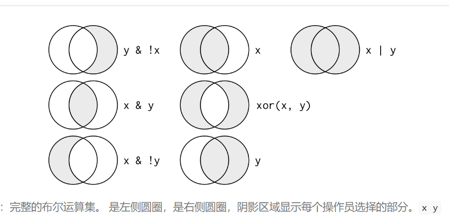

# R4ds 学习之路 [:mag:]
[toc]
<details>
    <summary>目录</summary>
- [ggplot](#ggplot)
- [数据转换](#数据转换)
- [数据探索分析](#数据探索分析)

</details>


## ggplot

ggplot**分层**绘图的七个参数

```r
ggplot(data = <data>) +
    geom_<function>(
        mapping = <mapping>,
        stat = <stat>,
        postion = <postion>) +
    coord_<function>() +
    facet_<function>()
```

> `position`: 位置参数，三种`fill`, `identity`, `dodge`对应堆叠、精确重叠对象分组
> `facet`: 分面，facet_wrap | facet_grid,需要用到函数指明分面变量
> `coord`:坐标系，常见的 coord_flip | coord_polar

## 数据转换

!!!note 由于对于浮点数的存储并不能达到无限精度，所以 1/49\*49 == 1 这种判断结果为 F，此时需要用到 near(x,y)函数

1. filter 子集化，注意比较和逻辑运算符，注意`%in%`的使用。其中`xor()`对应的是`(x & !y) & (y & !x)` 
   - filter 函数计算时并不会纳入 NA，所以 filter(.data,is.NA(cond)|cond)
2. 缺失值 NA：要正确明白其是未知数，但 NA^0 = 1,NA & T = T，NA + 1 = NA.同时也要注意`lapply`\`apply`和其的联用
3. arrange():缺失值一直排在末尾
4. select():选择变量，注意与 starts_with(),contains(),matchs(),all_of(),one_of()和 everything()调换顺序等联用
5. summarise()与 group_by()和 ungroup()联用分或者取消分组计算结果
6. reshape::melt(id = )和 dcast(~)分别融合和重塑数据，melt 需要将非融合变量放入 id 变量中，dcast 公式左边是 id 右边是融合的变量。tidy 包中的函数时 pivot_longer()和 pivot_wider()
   1.separate()用于拆分变量，重要变量 sep，拆分后的变量类型会变化，可设置 convert = true 参数，unite()用于合并变量

## 数据探索分析

`.`和`.data`:在绘图和管道等操作中可以用.data 和.来代替数据集

## 数据类型

tibble 格式相对于数据框格式有显示类型和不会强制转换因子等优点

1. 数字:parse 相对于 as 有许多优点，比如对于'$22%'字符串转换，as 会报错，parse 则会忽视数字前方的非数字，并且对于 12，100 这些其他计数方式，parse 也能设置 locale 参数处理

## 模型构建

1. 模型公式中 x^2 也需要加 I()转换符，要不然会直接当成 x
2. 模型正交多项式可以帮助简化多项式，模型构建一样，但是参数不同
3. data_grid()和 seq_range()能分别处理类别重复变量和连续变量，生成的变量能用于模型的预测，同时参数 trim 和 expand 对于拖尾数据等也有较好效果
4. add-predictions、gather_predictions 和 spread_predictions 都能根据模型增加预测值(残差)，但是后两者是针对多个模型，常见新的模型变量，方便绘图比较
   - 多项式回归：poly(x,degree),注意数据外推
   - 样条回归：需要用到 spline 包，ns()，geom_line()加线条时，需要指定 aes(y = pred)
5. model_matrix()能显示模型构建中的细节，如样条

!!!note 循环变量命名中，不能用赋值符号，需要用到 assign，如 assign(paste0('mod',i),model)
r 中的 lm 函数会直接将多因子变量转换为哑变量进行分析

- 回归的种类

  1. glm:广义线性模型，普通的线性模型要求响应值是连续的，并且要求误差项呈正态分布。广义线性模型拓展了响应值的类型，并且对距离的度量是根据似然来估计
  2. mgcv::gam：拓展 glm，使其能包含任意的平滑函数，后续加上一定的约束平滑项
  3. glmnet:glmnet：惩罚线性回归使用最大似然估计，在线性模型(logistic,cox 等都能用）中加入惩罚项，如 lasso，岭回归等
  4. MASS::rlm:稳健回归，适合处理异常值
  5. rpart:rpart():回归树，分段的常数模型，常常需要搭配先验知识(prior)

- 模型构建
  1.

## 生存分析

### 生存数据

$(t_i,\delta_i)$是生存数据的形式，t 是删失和最后随访时间，δ 是 0/1 变量，0 = censored， 1 = event。在 r 中用 Surv(time,status)表示生成生存数据


## 新的函数
`unlist`将数据框转换为单列
